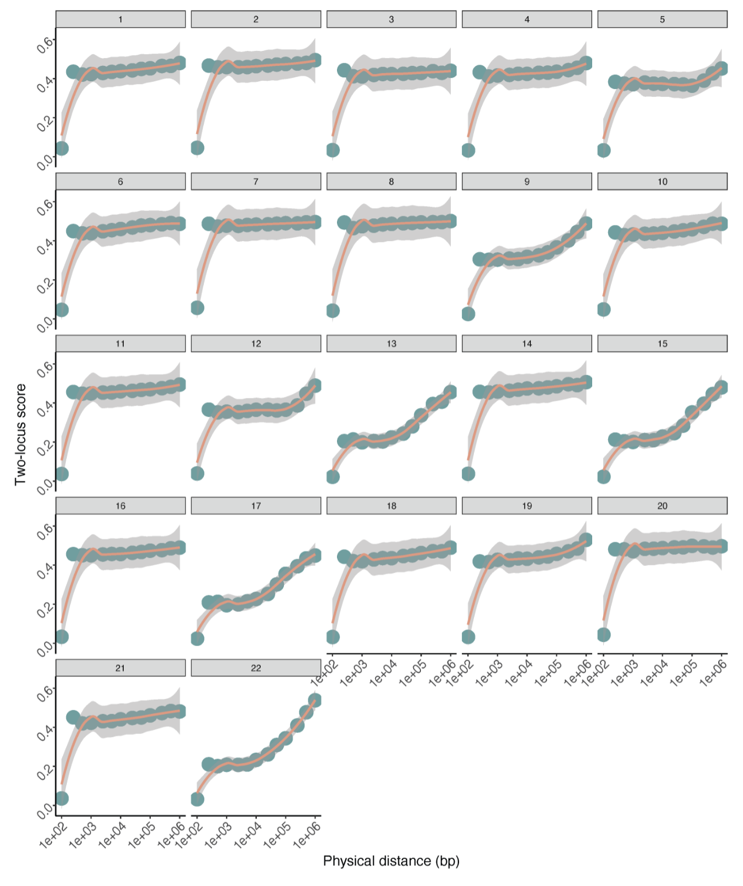

# Debug and Refinement

## Dependencies

### R environment

```
conda install -c conda-forge r-data.table
conda install -c conda-forge r-e1071
conda install -c conda-forge r-ggplot2
conda install -c conda-forge r-r.utils
```

### Other tools

Authors put the binary compatibility tools including `samtools, bcftools, beagle` in the app folder. If you want to specify tools by yourself, there are several modifications to do.  
I encountered some errors while running bcftools provided by the author and decided to use module in HPC, so take bcftools as an example here.  
Line `243,423` in `Monopogen.py`; Line `210` in `somatic.py`

```
bcftools = os.path.abspath(args.app_path) + "/bcftools"
```

Revised to:

```
bcftools = "bcftools" # or path to your bcftools
```

## Sex chromosomes is not considered by default

If you consider the X chromosome, you need to modify the following code.

#### The way to specify imputation panel

The source code has hardcoded the imputation panel.  
Line `76` in `Monopogen.py`

```python
imputation_vcf = args.imputation_panel + "CCDG_14151_B01_GRM_WGS_2020-08-05_" + record[0] + ".filtered.shapeit2-duohmm-phased.vcf.gz” 
```

However, the naming convention for the X chromosome's imputation panel in 1KG differs from that of the autosomes. It has been modified to be specified externally.

```python
imputation_vcf = args.imputation_panel
```

After that, the code for judging the type of `args.imputation_panel` also needs to be modified.  
Line `92` in `germline.py`

```python
assert os.path.isdir(args.imputation_panel)
```

Revised to:

```python
assert os.path.isfile(args.imputation_panel)
```

#### Add X chromosome in multiple loops

Line `111,306,318` in `Monopogen.py`

```python
for chr in range(1, 23):
    ...
```

Revised to:

```python
chromosomes = list(range(1, 23)) + ['X']
for chr in chromosomes:
    ...
```

#### Modify source file

The resource file `Monopogen\resource\GRCh38.region.10MB.lst` and `Monopogen\resource\GRCh38.region.50MB.lst` does not contain the X chromosome also results in the X chromosome not being considered.   
Add lines below to `GRCh38.region.10MB.lst` for example.

```
chrX,2,10000001
chrX,10000002,20000001
chrX,20000002,30000001
chrX,30000002,40000001
chrX,40000002,50000001
chrX,50000002,60000001
chrX,60000002,70000001
chrX,70000002,80000001
chrX,80000002,90000001
chrX,90000002,100000001
chrX,100000002,110000001
chrX,110000002,120000001
chrX,120000002,130000001
chrX,130000002,140000001
chrX,140000002,150000001
chrX,150000002,156040895
```

## Rewrite code spliting bam by cell barcodes

The original code, when splitting the original BAM file by CB, iterates through the BAM file as many times as there are different CBs, which is very inefficient.  
Therefore, the code has been rewritten to accomplish the task with just a single iteration through the BAM file.  
  
Substitute Line `160-196` (`def bamSplit`) in `somatic.py` by lines below.
```python
def splitBam(cell_barcodes, out_dir, app_path):
    samtools = app_path + "/samtools"
    output_bam =  out_dir + "/Bam/merge.filter.targeted.bam" 
    infile = pysam.AlignmentFile(output_bam, "rb")
    header = infile.header.copy()

    avail_read = 0
    # create dictionary
    outfiles = {}
    for cell in cell_barcodes:
        tp = infile.header.to_dict()
        
        if len(tp['RG']) > 1:
            tp['RG'] = [tp['RG'][0]]
        tp['RG'][0]['SM'] = cell
        tp['RG'][0]['ID'] = cell

        outfile = pysam.AlignmentFile(os.path.join(out_dir, "Bam/split_bam", cell + ".bam"), "wb", header=tp)
        outfiles[cell] = outfile

    for read in infile:
        cell_barcode = robust_get_tag(read, "CB")
        if cell_barcode in outfiles:
            outfiles[cell_barcode].write(read)
            avail_read = avail_read + 1

    for outfile in outfiles.values():
        outfile.close()
    infile.close()

    for cell in cell_barcodes:
        cmd = f"{samtools} index {os.path.join(out_dir, 'Bam/split_bam', cell)}.bam"
        os.system(cmd)

    return(avail_read)
```

Then substitute Line `188-200` in `Monopogen.py` by lines below.

```python
result = splitBam(cell_lst, args.out, args.app_path)
if result==0:
    logger.error("No reads detected for cells in " + args.barcode + ". Please check 1) the input cell barcode file is matched with bam file; 2) the cell barcode name has the same format shown in bam file. For example XX-1!")
    logger.error("Failed! See instructions above.")
exit(1)
```

??? question "Line `188-200` in `Monopogen.py`"

    ```python
    joblst = []

    for cell in cell_lst:
            para = "merge" + ":" + cell + ":" + args.out + ":" + args.app_path
            joblst.append(para)

    with Pool(processes=args.nthreads) as pool:
        result = pool.map(bamSplit, joblst)

    if sum(result)==0:
        logger.error("No reads detected for cells in " + args.barcode + ". Please check 1) the input cell barcode file is matched with bam file; 2) the cell barcode name has the same format shown in bam file. For example XX-1!")
        logger.error("Failed! See instructions above.")
        exit(1)
    ```
  
## Other bugs

### Haven't generate index of vcf file.

Add lines above after Line 85 in `Monopogen.py`

```python
cmd6 = tabix + " -p vcf " + args.out + "/germline/" +  jobid + ".gl.vcf.gz; " + tabix + " -p vcf " + out + "/germline/" + jobid + ".phased.vcf.gz"
f_out.write(cmd6 + "\n")
```

### Separator is not specified in `read_csv`.

The cell barcode file includes two column: 1.cell barcode; 2.number of reads detected in each cell (separated by tab).  
Line `179-180` in `Monopogen.py`

```python
cell_clst = pd.read_csv(args.barcode)   
df = pd.DataFrame(cell_clst, columns= ['cell','id'])
```

Revised to:

```
df = pd.read_csv(args.barcode,sep="\t",header=0)
```

### Indent error

Line `190` in `Monopogen.py`

```python
for cell in cell_lst:
				para = "merge" + ":" + str(cell) + ":" + args.out + ":" + args.app_path
				joblst.append(para)
```

### Release the limit on the number of files that can be opened simultaneously

During the joint calling process, the BAM file of each cell is opened. When the number of cells is large, this can exceed the limit of the number of files that can be opened by the Linux system simultaneously. The default value is set to 1048. When the number of your cells exceeds this value, it needs to be adjusted.

```
ulimit -n 2048 # According to your cell barcode count.
```

## Issues in LDrefinement.R

### Issues in define SNV pairs

When germline SNV pairs found within the current cell do not surround any de novo SNVs with reads, the process still proceeds to calculations for somatic SNVs. To improve efficiency, an additional layer of judgment is added to the calculations for de novo SNVs.  

Line `113-129` and Line `162-177` in `LDrefinement.R`  

```R
if(length(somaticIndex_i) > 0){
    # Line 113-129 or Line 162-177
}
```

In the trioloci model, a list of germline SNVs with reads, sorted by coordinates, is first extracted. Then, the nearest downstream germline SNV to the de novo SNV is selected. It is directly assumed that another SNV in the list with a larger coordinate than the first one forms a triolocus with it. However, there is no check to confirm whether the coordinates of this SNV are indeed larger than those of the de novo SNV, which may lead to issues. Add a conditional statement to make process more robust.  
  
Line `169` in `LDrefinement.R`  
```R
if(mat[lower1,i]==mat[upper1,i] && dis[upper1]>dis[j]){...}
```

### Issue in the funtion `weighthedP`

The function `weighthedP` is designed to calculate the LD-refinement score of de novo SNVs based on the LD-refinement score of germline SNV pairs. However, it's nonsensical that the bin size for physical distance used here is different from the one used when calculating the LD-refinement score for germline SNV pairs. This needs to be modified.  

```R
# binsize in calculating germline LD-refinement score (Line 222 in LDrefinement.R)
binsize <- c(0, 100, 200, 300, 400, 500, 1000, 2500, 5000, 7500, 10000, 20000, 50000, 100000, 500000, 1000000000000000000)
# binsize in calculating somatic LD-refinement score (Line 204 in LDrefinement.R)
binsize <- c(0, 100, 500, 1000, 2500, 5000, 7500, 10000, 20000, 50000, 100000, 500000, 1000000000000000000)
```

Moreover, when indexing the germline LD-refinement score corresponding to the distance of the loci pair, the index is incorrect and should be `i-1`.  

Line `213` in `LDrefinement.R`  
```R
rd_w <- c(rd_w, (1-table$Prob[i])^2)
```
Revised to
```R
rd_w <- c(rd_w, (1-table$Prob[i-1])^2)
```

### Issue in adjusting LD refinement score based on their phasing information

When refining the final score for each site, if one of the two-loci and trio-loci LD-refinement scores is missing, the final score is assigned as NA, which is not quite reasonable. It has been modified to be assigned as the existing score among the two.  
Line `346-353` in `LDrefinement.R`  

```R
for(i in seq(1,nrow(dt),1)){
   if(is.na(a[i])){a[i]<-10}
   if(is.na(b[i])){b[i]<-10}
   dt$p_LDrefine[i] <- (a[i]+b[i])*0.5
   if(dt$p_LDrefine[i]>1){
    dt$p_LDrefine[i] <- NA
   }
}
```
Revised to
```R
for(i in seq(1,nrow(dt),1)){
   if(!is.na(a[i]) &  !is.na(b[i])){
     dt$p_LDrefine[i] <- (a[i] + b[i])/2
   }
   if(!is.na(a[i]) &  is.na(b[i])){
     dt$p_LDrefine[i] <- a[i]
   }
   if(is.na(a[i]) &  !is.na(b[i])){
     dt$p_LDrefine[i] <- b[i]
   }
}
```
## Paint germline LD refinement score plot of all chromosomes in a picture

Author didn't provide the code painting germline LD refinement score plot of all chromosomes in a picture like below. You can use the script below directly.  

<figure markdown>
  { width="50%" }
  <figcaption>Twoloci model from paper</figcaption>
</figure>

```R
library(ggplot2)

dir <- "path/to/monopogen/somatic/"
chr_list <- c(1:22,'X')
all_data <- data.frame()

for (i in chr_list) {
  file_name <- paste0(dir, "chr", i, ".germlineTrioLoci_model.csv")
  data <- read.csv(file_name, header = TRUE)
  data$bin[data$bin>5*10^5] <- 50*10^5
  data$Chromosome <- as.factor(paste("Chr", i, sep=""))
  all_data <- rbind(all_data, data)
}
p <- ggplot(all_data, aes(x=bin, y=Prob)) +
  geom_point(color="cadetblue",size=6)+
  geom_smooth(color="darksalmon") + scale_x_continuous(trans='log10') +
  theme_bw() + theme(panel.border = element_blank(), panel.grid.major = element_blank(),
                     panel.grid.minor = element_blank(), axis.line = element_line(colour = "black")) + xlab("Physical distance (bp)") +
  ylab("LD refinement score") +
  ylim(0,0.65) +
  facet_wrap(~ Chromosome, ncol = 6) +
  labs(title = "Three-locus LD refinement score on germline SNVs") +
  theme_minimal() +
  theme(
    strip.text.x = element_text(size = 18, face = "bold"),
    strip.background = element_rect(fill = "lightgray", size = 1),
    plot.title = element_text(hjust = 0.5,size = 18, face = "bold"),
    axis.text.x = element_blank(),
    axis.text.y = element_blank(),
    axis.ticks = element_blank(),
    axis.title.x = element_text(size = 18),
    axis.title.y = element_text(size = 18),
    panel.grid.major = element_blank(),
    panel.grid.minor = element_blank(),
    panel.spacing = unit(0.5, "lines")
  )
p <- p + theme(
  axis.ticks = element_line(color = "black"),
  axis.text.y.left = element_text(color = "black", size=18),
  axis.text.x.bottom = element_text(angle = 90, hjust = 1, color = "black", size=18)
)
print(p)
ggsave(paste0(dir,"LDrefinement_germline_trioloci_allchr.pdf"), plot = p, device = "pdf", width = 20, height = 15, dpi = 300)
```

