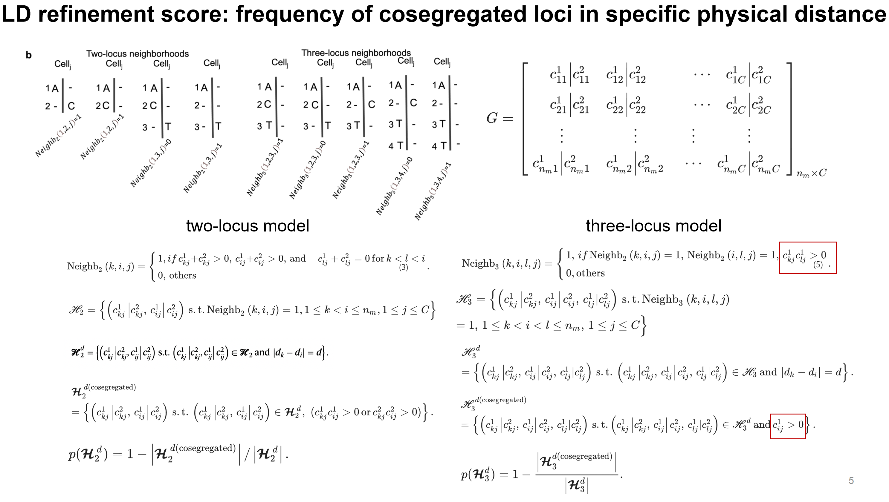
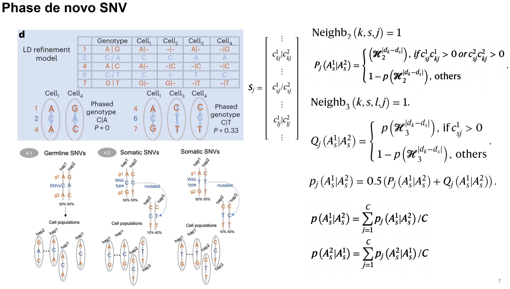

# Issue about formula

## Methods in paper

The pictures below demonstrates the method of Monopogen described in paper.

<figure markdown>
{ width="80%" }
</figure>

<figure markdown>
{ width="80%" }
</figure>

In brief, for each custom-defined physical distance bin, Monopogen calculates a linkage proportion for germline SNV pairs within that distance, and then takes its reciprocal, meaning the closer this value is to 1, the more likely it is that the remaining allele of two SNVs is on the same haplotype within this distance range.  
Subsequently, this is used as a reference to calculate the phasing probability of the allele of a de novo SNV, which involves calculating the probability that it is on the same haplotype with adjacent germline SNVs for both phasing scenarios. An average value is taken across all cells, with the higher value indicating the final phasing at the cell population level, and the lower value serving as an indicator for measuring somatic mutations (the higher it is, the more likely it is somatic).

## Code implementation

### Code

The code below calculates the phasing probability of de novo SNV.  

```R
weigthedP <- function(dis=NULL, match=NULL, table=NULL){
  binsize <- c(0, 100, 200, 300, 400, 500, 1000, 2500, 5000, 7500, 10000, 20000, 50000, 100000, 500000, 1000000000000000000)
  rd_p <-c()
  rd_w <-c()
  for(i in seq(2,length(binsize),1)){
    index <-which(dis<binsize[i] & dis>=binsize[i-1])
    if(length(index>0)){
      pval <- sum(match[index])/length(index)
      rd_p <- c(rd_p, pval)
      rd_w <- c(rd_w, (1-table$Prob[i-1])^2)
    }
  }
  p <- 1-sum(rd_p*rd_w)/(sum(rd_w))
  return(p)
}
```

### Formula

Abstract the above code into below mathematical formula.  

First, for each de novo SNV, the distances to the nearest germline locus are calculated (one locus in the two-loci model and two loci in the trio-loci model). Subsequently, a phasing mode is fitted (`0|1` or `1|0`). Set $V_{match} = 1$ if the observed allele matches the nearest germline locus in this phasing mode, and $V_{match} = 0$ otherwise.  
Consider two distinct sets used in the formulation of analysis. Firstly, let $B = \{b_1,b_2,...,b_i,...,b_n\}$ 
represent the set of multiple physical distance bins. Each element within this set corresponds to a specific bin. Secondly, for each site, define $C = \{c_1,c_2,...,c_i,...,c_n\}$ as the set comprising all cells that exhibit reads at that particular site. For each de novo SNV loucs, calculate  

\begin{align}
M_{b_i} &= \frac {\sum_{c_i \in C} (V_{match} | b_i, c_i)} {N_C} \tag{1} \\[10pt]
P_{b_i} &= (1 - P_{two_loci} | b_i)^2 \tag{2} \\[10pt]
P_{final} &= 1 - \frac {\sum_{b_i \in B} (M_{b_i} * P_{b_i})} {\sum_{b_i \in B} P_{b_i}} \tag{3} 
\end{align}

where $V_{match} | b_i, c_i$ denots $V_{match} value in a specific bin $b_i$ and cell $c_i$, $N_C$ denotes the count of cells that have reads in this locus, $M_{b_i}$ denotes the average of $V_{match}$ among cells in the $b_i$, $P_{two_loci} | b_i$ denots two-locus germline LD-refinement score in the $b_i$, $P_{b_i}$ denotes the reciprocal square value of $P_{two_loci} | b_i$ in the $b_i$.  

The calculation process of $P_{final}$ in trio-locus model is the same as above.  
If one of the two-loci and trio-loci LD-refinement scores is missing, $P_{final}$ is refined as the existing score among the two.  If both of them exist, $P_{final}$ is refined as the average of two score:  

\begin{align}
P_{final} = \frac {P_{final,two-locus} + P_{final,trio-locus}} {2} \tag{4} 
\end{align}

If $P_{final} < 0.5$, $P_{final}$ is refined as its reciprocal:  

\begin{align}
P_{final} = 1 - P_{final} \tag{5}
\end{align}

## Discussion
