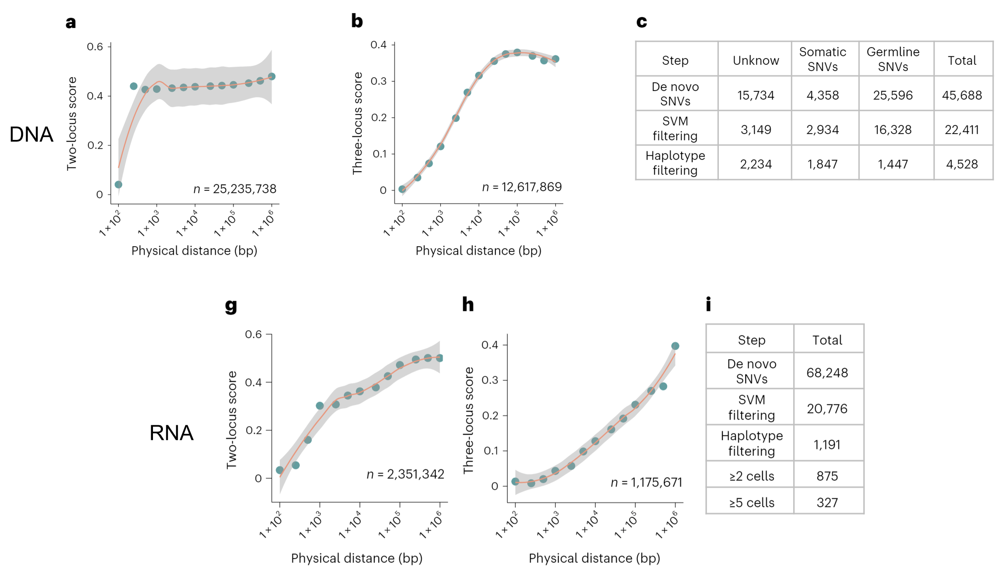
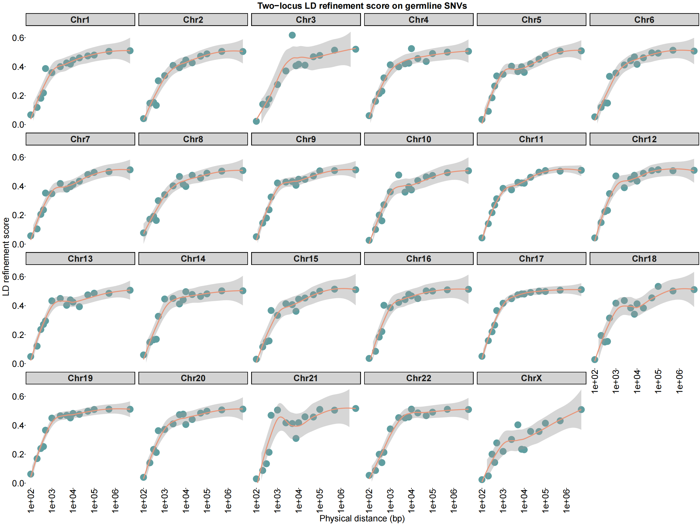
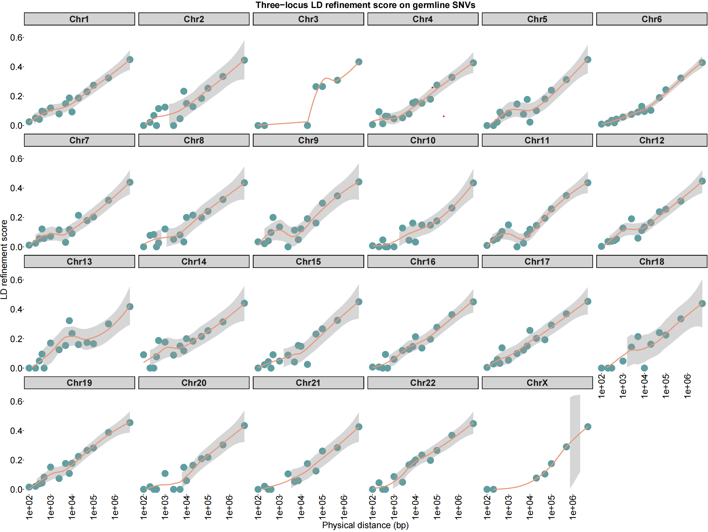

# Results

## Reference

The following image which demonstrates germline LD-refinement score in sc-DNA-seq and sc-RNA-seq comes from the monopogen article for reference.

<figure markdown>
  { width="100%" }
  <figcaption>Germline LD-refinement score in sc-RNA-seq and sc-DNA-seq </figcaption>
</figure>

## Germline LD-refiment scores in sc-ATAC-seq

### Two-loci model

<figure markdown>
  { width="80%" }
  <figcaption>Germline LD-refinement score in sc-ATAC-seq (two-loci model) </figcaption>
</figure>

### Trio-loci model
<figure markdown>
  { width="80%" }
  <figcaption>Germline LD-refinement score in sc-ATAC-seq (Trio-loci model) </figcaption>
</figure>

**Generally, the LD-refinement scores and their trends in sc-ATAC-seq are more akin to those observed in sc-RNA-seq rather than in sc-DNA-seq**.

## Putative somatic SNV

Taking chr18 as an example, samtools mpileup yielded a total of `54,343` sites, of which `39,526` sites overlapped with 1KG panel. The SNV sites for phasing include those filtered with `ref and alt dp > 4` and the aforementioned sites overlapping with 1KG, totaling `39,586`. This means that the candidate de novo SNV sites are very few, only in the tens. The final output of putative somatic SNV sites was only `22`, which are filtered by SVM model. The improvement needed is **how to increase the number of de novo SNVs**.  
The following is the list of putative somatic SNVs of chr18:  
??? "take chr18 as an example"
    {{ read_csv('./tables/chr18.putativeSNVs.csv') }}

